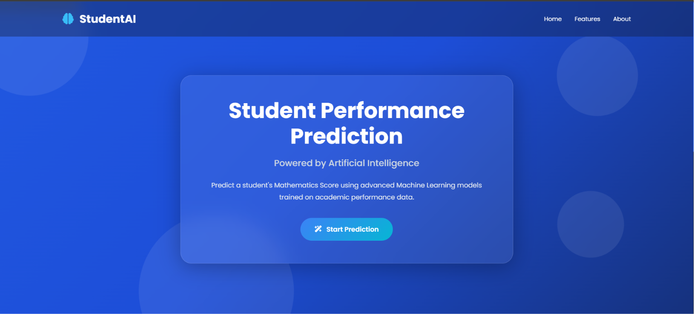
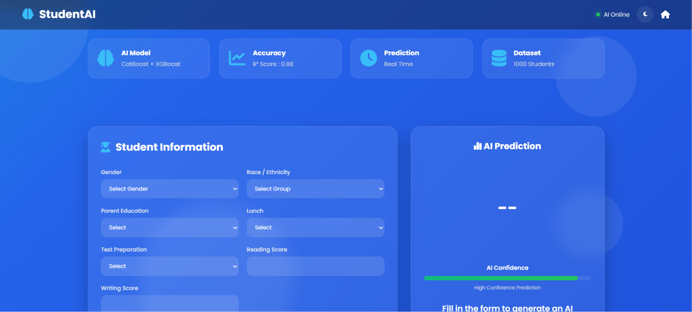
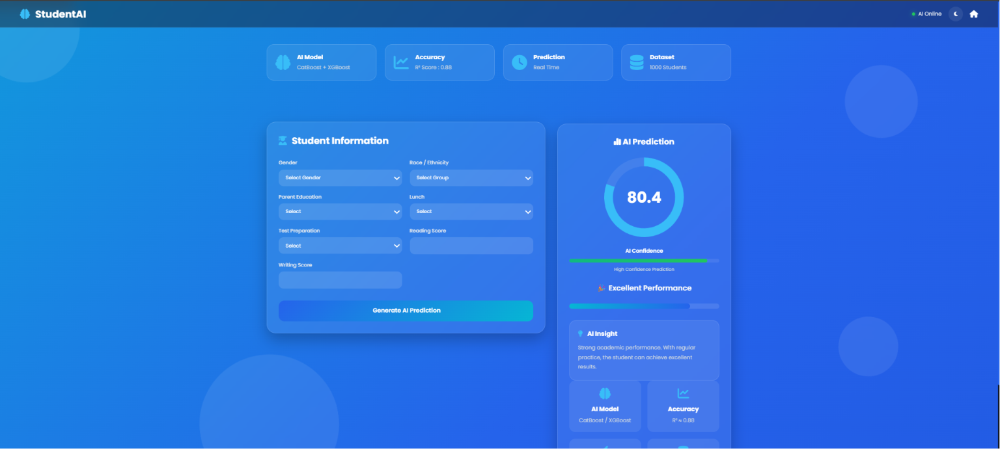

# 🎓 Student Performance Prediction System

<p align="center">


</p>

<p align="center">

A modern end-to-end Machine Learning web application that predicts a student's <strong>Mathematics Score</strong> based on academic and demographic attributes using multiple regression algorithms.

</p>

---

## 📌 Overview

Student Performance Prediction System is an end-to-end Machine Learning project built with **Python**, **Scikit-Learn**, and **Flask**.

The application predicts a student's **Mathematics Score** by analyzing:

* Gender
* Race/Ethnicity
* Parental Level of Education
* Lunch Type
* Test Preparation Course
* Reading Score
* Writing Score

The project follows a complete Machine Learning workflow, including data ingestion, preprocessing, model training, model selection, serialization, prediction pipeline, and deployment through a Flask web application.

---

# ✨ Features

* 🤖 End-to-End Machine Learning Pipeline
* 📊 Data Ingestion & Preprocessing
* 🧹 Missing Value Handling
* 🔄 Feature Scaling
* 🏷️ One-Hot Encoding
* 🧠 Multiple Regression Models Comparison
* ⚙️ Hyperparameter Tuning
* 🏆 Automatic Best Model Selection
* 💾 Model Serialization using Pickle
* 🌐 Flask Web Application
* 🎨 Modern AI-Inspired Dashboard UI
* 📈 Real-Time Prediction
* 📱 Responsive Interface

---

# 🏗️ Project Architecture

```text
Dataset
   │
   ▼
Data Ingestion
   │
   ▼
Train-Test Split
   │
   ▼
Data Transformation
   │
   ├── Missing Value Imputation
   ├── One-Hot Encoding
   └── Feature Scaling
   │
   ▼
Model Training
   │
   ├── Linear Regression
   ├── Decision Tree
   ├── Random Forest
   ├── Gradient Boosting
   ├── AdaBoost
   ├── XGBoost
   └── CatBoost
   │
   ▼
Best Model Selection
   │
   ▼
Prediction Pipeline
   │
   ▼
Flask Web Application
```

---

# 🧠 Machine Learning Models

The project evaluates multiple regression algorithms before selecting the best-performing model.

* Linear Regression
* Decision Tree Regressor
* Random Forest Regressor
* Gradient Boosting Regressor
* AdaBoost Regressor
* XGBoost Regressor
* CatBoost Regressor

The model with the highest validation performance is automatically selected and saved.

---

# 🛠️ Tech Stack

### Programming Language

* Python

### Machine Learning

* Scikit-Learn
* CatBoost
* XGBoost
* NumPy
* Pandas

### Web Framework

* Flask

### Data Visualization

* Matplotlib
* Seaborn

### Frontend

* HTML5
* CSS3
* JavaScript
* Font Awesome

---

# 📂 Project Structure

```text
MLproject/
│
├── artifacts/
│
├── notebook/
│
├── src/
│   ├── components/
│   │   ├── data_ingestion.py
│   │   ├── data_transformation.py
│   │   └── model_trainer.py
│   │
│   ├── pipeline/
│   │   └── predict_pipeline.py
│   │
│   ├── exception.py
│   ├── logger.py
│   └── utils.py
│
├── static/
│   ├── css/
│   └── js/
│
├── templates/
│   ├── index.html
│   └── home.html
│
├── app.py
├── requirements.txt
├── setup.py
└── README.md
```

---

# ⚙️ Installation

Clone the repository

```bash
git clone https://github.com/YOUR_USERNAME/MLproject.git
```

Move into the project directory

```bash
cd MLproject
```

Create a virtual environment

```bash
python -m venv venv
```

Activate the environment

Windows

```bash
venv\Scripts\activate
```

Linux / macOS

```bash
source venv/bin/activate
```

Install dependencies

```bash
pip install -r requirements.txt
```

Run the Flask application

```bash
python app.py
```

Open your browser

```text
http://127.0.0.1:5000
```

---

# 📊 Input Features

| Feature            | Description                |
| ------------------ | -------------------------- |
| Gender             | Male / Female              |
| Race/Ethnicity     | Group A – Group E          |
| Parental Education | Highest education level    |
| Lunch              | Standard / Free or Reduced |
| Test Preparation   | Completed / None           |
| Reading Score      | 0 – 100                    |
| Writing Score      | 0 – 100                    |

---

# 🎯 Prediction Output

The application predicts the student's **Mathematics Score** and displays:

* Predicted Score
* Performance Category
* AI-Based Insight
* Confidence Indicator

---

# 📈 Model Performance

The trained model achieved an approximate:

**R² Score: 0.88**

indicating strong predictive performance on the evaluation dataset.

---

## 📸 Screenshots

### 🏠 Landing Page



---

### 📋 Prediction Dashboard



---

### 📊 Prediction Result


---

# 🚀 Future Improvements

* User Authentication
* Prediction History
* Interactive Analytics Dashboard
* Model Explainability (SHAP/LIME)
* Docker Support
* CI/CD Pipeline
* Cloud Deployment
* REST API
* Batch Prediction
* Database Integration

---

# 👨‍💻 Author

**Monish R**

* Computer Science Engineering Student
* AI & Machine Learning Enthusiast
* Passionate about building intelligent and scalable applications.

---

# ⭐ Support

If you found this project useful, consider giving it a ⭐ on GitHub.
